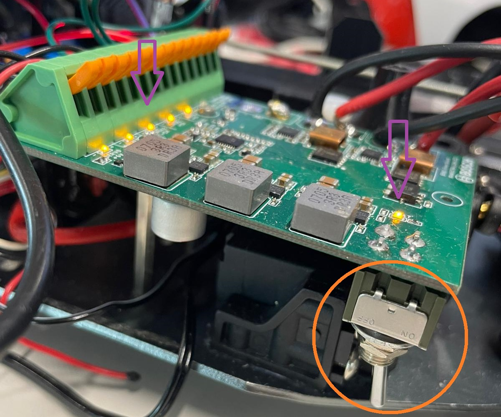
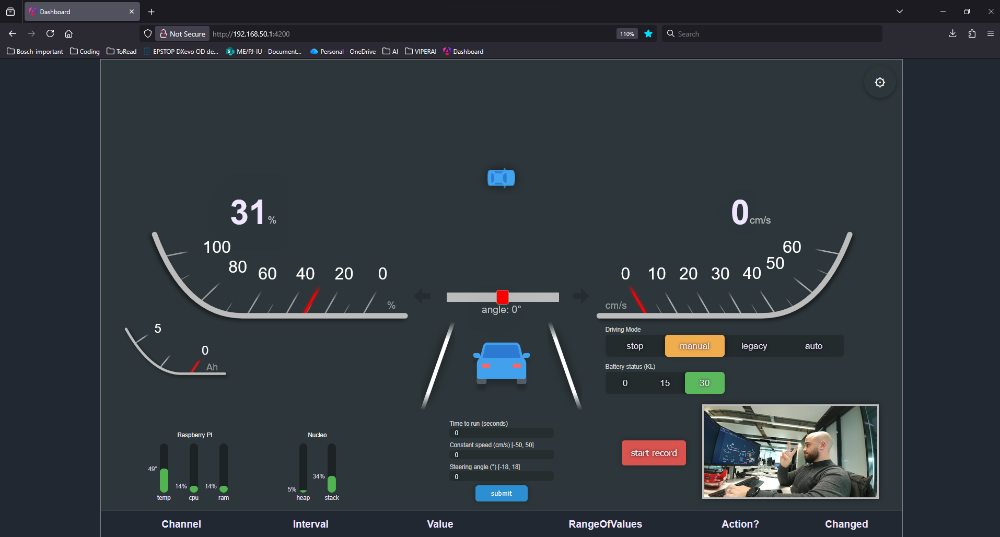

Demo
====

.. toctree::
   :maxdepth: 2
   :hidden:

   demo/freshstart
   demo/services
   demo/explaining

* :doc:`Fresh start <demo/freshstart>`
  
  - How to set up your Raspberry Pi from scratch.

* :doc:`Services description <demo/services>`
  
  - How the installed services work.

* :doc:`Explaining <demo/explaining>`
  
  - Overview of the dashboard and how to add/remove fields.

1. Power Up the System
----------------------

- Ensure the battery is connected to the power board.  
- Turn on the power supply using the switch.  
- The LEDs should turn on.

2. Power Up the Brushless Motor & ESC
-------------------------------------

- Press the button once to start the ESC.  
- You should hear **two short beeps** (motor ready) followed by a **slightly longer beep** (ESC calibrated).  
- The button should begin flashing red.

+--------------------------+--------------------------+
| |pic1|                   | |pic2|                   |
+--------------------------+--------------------------+

.. |pic1| image:: ../images/demo/EngineButtonOFF.jpg
  :width: 40%

.. |pic2| image:: ../images/demo/EngineButtonON.jpg
  :width: 40%

..
  .. image:: ../images/demo/EngineButtonOFF.jpg
    :align: center
    :width: 25%

  .. image:: ../images/demo/EngineButtonON.jpg
    :align: center
    :width: 25%

3. Wait & Connect to Wi-Fi
--------------------------

- Wait for the Wi-Fi network **BFMCDemoCar** to appear.  
  (On first boot with our image, the Raspberry Pi may take longer than expected.)  
- Connect using the password: **supersecurepassword**  
- Or scan the QR code below (works on a phone as well):

4. Connect to the Frontend
--------------------------

- Open any browser and go to: **http://192.168.50.1:4200**  
- Or scan the QR code:

5. Log In & Initialize
----------------------

- Wait for the **“Backend connection lost”** message to disappear.  
  (The frontend starts immediately; the backend starts only after the webpage connects.)  
- Leave the password field empty.  
- Press **Submit**.  
- Close the **"Security Setup Required"** popup.  
  It will reappear until you set a password in  
  ``src/dashboard/frontend/src/app/app.component.ts`` (line 50).  
- To change the popup timeout, modify line 194 (value in ms).  
- To disable the alert entirely, set line 152 to **False**.

6. Explore the Interface
------------------------

- Set **Battery status (KL)** to:  
  - **15** for sensor data  
  - **30** for motor activation  
- Set **Driving mode → Manual** to control the car using the keyboard  
  (the beeper should activate).  
- Drive using: **W A S D** + **Space** (brake).  
- To stop, set **Driving Mode → Stop** and **Battery status → 0**  
  (the beeper should activate again).

