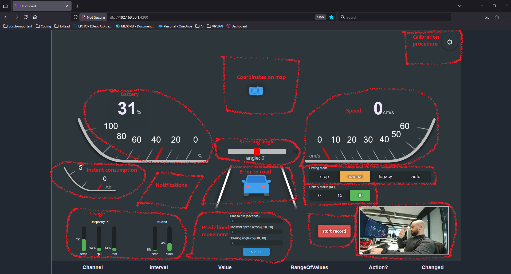
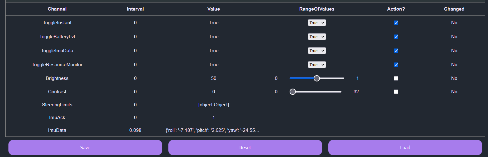

Explaining
==========

To add or modify a cluster in the dashboard, check the subfolders under: ``src/dashboard/frontend/src/app/cluster``

Currently `allMessages`_ going through the gateway are forwarded to the front-end. The backend component responsible for forwarding 
gateway messages to the frontend is: ``src/dashboard/processDashboard.py``. You can adapt it as needed.

The frontend has two main components: Dynamic view and JSON table.

Dynamic View
------------

- Messages **explicitly handled** in the dynamic view (image below) are processed in  
  ``src/dashboard/frontend/src/app/webSocket/web-socket.service.ts`` under the ``handledEvents`` list.

JSON Table
----------

Any message that is sent tot he frontend and is **not** explicitly handled in the dynamic view will appear in the JSON table automatically.

If you want to dynamically send messages **from** the JSON table, you must first add the corresponding entry to the  
`table_state`_ JSON file. The message names must match those defined in `allMessages`_.

.. _table_state: https://github.com/ECC-BFMC/Brain/blob/master/src/utils/table_state.json
.. _allMessages: https://github.com/ECC-BFMC/Brain/blob/master/src/utils/messages/allMessages.py

Fields explained:

- **Interval** – How frequently the message is received or sent.  
- **Value** – The most recent value of the message.  
- **Range** – The value to send/save (editable range, in case the message is set as a sending one).  
- **Action** – Enables Save/Load actions for this message.  
- **Changed** – Indicates that the current value differs from what is stored in the `table_state`_ file.

Button behavior:

- **Save** – Saves the selected value to the JSON file for future use  
  (e.g., saving tuned PID parameters).  
- **Load** – Sends the stored value through the gateway  
  (e.g., loading  PID tuning values).  
- **Reset** – Reverts the editable value to what is already stored in the JSON file  
  (e.g., undoing accidental overshoot while tuning).

|

Calibration Procedure
---------------------
The calibration process is meant to fine-tune the steering and speed control equations of the vehicle, 
ensuring accurate response to input commands. The procedure involves a series of velocities and speeds 
sent to the vehicle, followed by manual measuring the actual distance traveled, and the angle of the movement, all 
meant adjusting the equations accordingly.

.. tip::
  For optimal results, perform multiple calibration runs. Each subsequent run refines the steering and speed equations using the previous data, progressively improving accuracy.

.. tip::
  To ensure that measurements are as accurate as possible, ensure the mechanical state of the vehicle is in optimal conditions.
  i.e. Steering mechanism moves freely when driving manually, resetting correctly when releasing the steering. Motor moves chassys
  smoothly without jerks or unexpected resistance. Have your hardware specialist check the car and take a look at the :doc:`Hardware Improvements guide <../hardwaresetupofcar/hardwareimprovements>`.

- **Track Setup** – Requires a straight line of at least **3 meters** with unobstructed space. Place a second line at 90 degrees to the first for angle measurements. 

  .. image:: ../../images/demo/calibration_step1.png
     :align: center
     :width: 45%

  .. raw:: html

   

- **Calibration Process** – Involves positioning the vehicle, running it according to the specific step(Left, Right, Backward), and measuring the actual distance traveled.

  .. list-table::
     :widths: 50 50
     :align: center
     :class: borderless

     * - .. image:: ../../images/demo/calibration_step2.png
            :width: 85%
            :align: right
       - .. image:: ../../images/demo/calibration_step3.png
            :width: 76%
            :align: left

- **Visualizations** – Displays the zero offset spline and polynomial plots to verify the calibration model's accuracy before saving. The final steering plot's limits are adjusted by the zero offset value, which can result in points appearing beyond the nominal limits.
  
  .. list-table::
     :widths: 35 35
     :align: center
     :class: borderless

     * - .. image:: ../../images/demo/calibration_plot1.png
            :width: 85%
            :align: right
       - .. image:: ../../images/demo/calibration_plot2.png
            :width: 77%
            :align: left

- **Saving** – The new CPP files will be downloaded to the machine.

  .. image:: ../../images/demo/calibration_save.png
    :align: center
    :width: 45%

  .. raw:: html

   

- **Proceeding in embedded project** - Check :ref:`Go to calibration section <my_calibration_section>`

