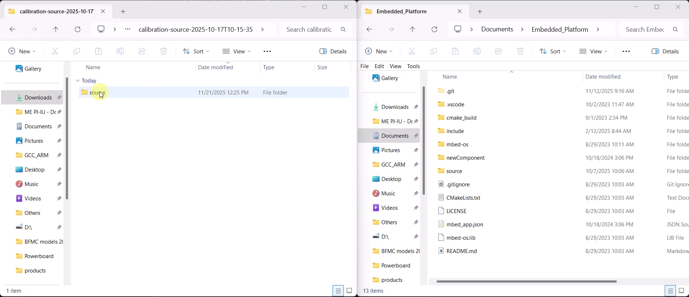

Calibration
=============

This page explains how to integrate the calibration results generated by the dashboard
into the Embedded project **and what happens internally once the new calibration
sources are added to the firmware**.

Overview
--------

The dashboard generates a set of C++ source files that contain updated polynomial
coefficients, steering offset values, spline data points, and speed/steer correction
tables. These files replace the previous calibration implementation inside the
``Embedded_Platform`` project.

During firmware build, the embedded code automatically incorporates the new
calibration parameters and uses them at runtime for:

- Translating steering commands into corrected wheel angles  
- Adjusting motor speed using the updated polynomial mapping  
- Applying the zero-offset correction obtained during calibration  
- Improving trajectory accuracy using the newly generated splines  

No manual editing of the source code is required — only copying the generated
``source`` folder into the correct location.

Internal behavior
-----------------

The generated archive contains a ``source`` folder with two files:

- ``speedingmotor.cpp``
- ``steeringmotor.cpp``

These files already exist in the ``Embedded_Platform`` project. When you copy the
new versions over the existing ones, the firmware behavior is updated as follows.

Calibration flags and limits
~~~~~~~~~~~~~~~~~~~~~~~~~~~~

Both files define a common calibration configuration:

.. code-block:: cpp

   #define calibrated      0
   #define calib_sup_limit 500
   #define calib_inf_limit -500

In the *default* Embedded_Platform sources:

- ``calibrated`` is set to ``0`` (calibration disabled)
- ``calib_sup_limit`` and ``calib_inf_limit`` use generic default bounds

In the *generated* files:

- ``calibrated`` is set to ``1`` to enable the calibrated behavior
- ``calib_sup_limit`` and ``calib_inf_limit`` are updated with the limits computed
  during the calibration process

These limits are used to clamp the output of the control logic to safe ranges.

Polynomial-based control
~~~~~~~~~~~~~~~~~~~~~~~~

Both ``speedingmotor.cpp`` and ``steeringmotor.cpp`` implement a
``computePWMPolynomial`` method. In the default sources this function only contains
a placeholder:

.. code-block:: cpp

   int CSpeedingMotor::computePWMPolynomial(int speed)
   {
       int64_t y = zero_default;
       // POLYNOMIAL CODE START

       // POLYNOMIAL CODE END
       return (int)y;
   }

The generated files fill in this method with the polynomial expression obtained
during calibration. The polynomial maps the requested speed or steering angle to
a PWM value, using the calibration data captured on the track.

Runtime selection: calibrated vs. legacy behavior
~~~~~~~~~~~~~~~~~~~~~~~~~~~~~~~~~~~~~~~~~~~~~~~~~

The motor classes expose high-level setters such as ``setSpeed`` (for the speed
motor) and ``setAngle`` (for the steering motor). Their structure is similar to:

.. code-block:: cpp

   void CSteeringMotor::setAngle(int f_angle)
   {
       pwm_value = zero_default;

       if (calibrated == 1)
       {
           pwm_value = computePWMPolynomial(f_angle);
       }
       else
       {
           pwm_value = interpolate(f_angle,steeringValueP, steeringValueN, pwmValuesP, pwmValuesN, 3);
       }

       m_pwm_pin.pulsewidth_us(pwm_value);
   }

- When ``calibrated == 0`` (default firmware), the code uses the legacy
  interpolation tables (``interpolate(...)`` and pre-defined lookup arrays).
- When ``calibrated == 1`` (after copying the generated files), the firmware
  switches to the polynomial model by calling ``computePWMPolynomial(...)``.

As a result, once the new ``speedingmotor.cpp`` and ``steeringmotor.cpp`` are copied
and the firmware is rebuilt and flashed, all speed and steering commands are
translated using the newly calibrated polynomial models and updated limits, rather
than the generic factory interpolation curves.

.. _my_calibration_section:

Steps
-----

Step 1. Extract the archive
----------------------------

1. Locate the downloaded file (e.g. ``calibration-source-2025-10-17T10-15-35.zip``).
2. Extract the archive to a temporary location.
3. After extraction, you should see a folder named ``source``.

Step 2. Copy the calibration source folder
-------------------------------------------

1. Open the extracted contents.
2. Copy the ``source`` folder.
3. Paste it into the ``Embedded_Platform`` directory of your Embedded project  
   (example: ``<project-root>/Embedded_Platform``).
4. If asked to overwrite existing files, choose **Replace**.

After this step, the firmware project will contain the latest calibration sources.
These files will automatically be compiled and linked during the next build.

.. raw:: html

   

Step 3. Build and flash
------------------------

Flash the firmware to the vehicle by following the instructions in the :doc:`Build & Flash Guide <../embeddedplatform/buildAndFlash>`.

Once flashing is complete, the vehicle will run using the newly generated
calibration model (steering, speed, and offset corrections).
