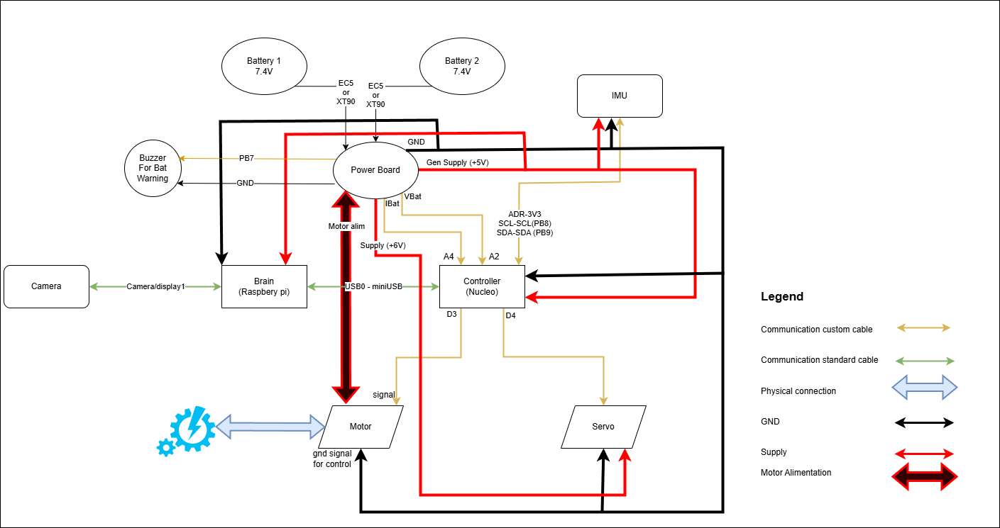

Connection diagram and components
==================================

.. toctree::
   :maxdepth: 1
   :hidden:

   hardwaresetupofcar/hardwareimprovements
   hardwaresetupofcar/IMU
   hardwaresetupofcar/powerboard

* :doc:`Hardware improvements guide <hardwaresetupofcar/hardwareimprovements>`

  - The kit could use some mechanical adjustments, like height elevation, reducing steering limitations, reducing mechanical friction. All by following this guide

* :doc:`IMU details <hardwaresetupofcar/IMU>`

  - Details regarding the IMU boards (3 versions).

* :doc:`Powerboard details <hardwaresetupofcar/powerboard>`

  - Details regarding the powerboard.

In this section, you can find all the topics related to the hardware of the vehicle, which is a 1/10 scale on-road chassis variant.

Each vehicle can come with various hardware small modifications, as it is designed for hobby usage. 

Here's the description of the car, with all it's components:

.. image:: ../images/hardwaresetupforcar/Car.png
   :align: center
   :width: 50%

In the following schematics you can see the connections diagram of all the HW components of the car. The GPIO lines are marked on each component.

And here's the table with all the components and all the needed details.
------------------------------------------------------------------------

.. container:: hardware-width-80

   .. list-table::
      :header-rows: 1
      :widths: 12 25 6 12 6 10 15

      * - Product
        - Description
        - Quantity
        - Mount Materials
        - Price
        - Others
        - Picture

      * - `Chassis`_
        - The base structure of the car. Model: Reely TC-04.
        - 1
        - Comes completely assembled.
        - ~€83
        - 
        - .. image:: ../images/hardwaresetupforcar/products/Chassis.jpg
           :width: 120px

      * - `Servo`_
        - Actuator used for the steering mechanism.  
          Model: RS-610WP (or similar).
        - 1
        - Comes with mounting screws + attachment horns.
        - ~€20
        - 
        - .. image:: ../images/hardwaresetupforcar/products/Servo.jpg
           :width: 120px

      * - `Motor`_
        - Brushless motor with integrated ESC. Controls vehicle speed.  
          Model: Quickrun Fusion SE, 1200KV.
        - 1
        - 2xM3x6 screws
        - ~€80
        - 
        - .. image:: ../images/hardwaresetupforcar/products/Motor.jpg
           :width: 120px

      * - `Brain`_
        - SoC for the autonomous logic.  
          Model: Raspberry Pi 5 (8GB).
        - 1
        - 2x m2x6
        - ~€90
        - 
        - .. image:: ../images/hardwaresetupforcar/products/Brain.jpg
           :width: 120px

      * - `Cooler`_
        - Active cooler for the Raspberry Pi.
        - 1
        - Comes with clips for mounting
        - ~€6
        - 
        - .. image:: ../images/hardwaresetupforcar/products/brainColler.jpg
           :width: 120px

      * - `Controller`_
        - Microcontroller controlling motors and interact with sensors.  
          Model: Nucleo F401RE.
        - 1
        - 2x m3x6
        - ~€21
        - 
        - .. image:: ../images/hardwaresetupforcar/products/Controller.jpg
           :width: 120px

      * - `Camera`_
        - Monocular wide-angle camera.  
          Model: Raspberry Pi Camera Module 3 (wide-angle).
        - 1
        - 2x m2x6 + 2x nuts
        - ~€38
        - 
        - .. image:: ../images/hardwaresetupforcar/products/Camera.jpg
           :width: 120px

      * - `Battery`_
        - 2-cell LiPo battery (4500–6200 mAh). Powers the entire vehicle.
          Though any LiPo with 2s should do.
        - 1
        - Attached to chasys with delimiters and clips.
        - ~€35
        - `Battery2`_
        - .. image:: ../images/hardwaresetupforcar/products/Battery.jpg
           :width: 120px

      * - :doc:`powerboard <hardwaresetupofcar/powerboard>`
        - Custom power distribution board. Supports dual batteries (2s or 3s),  
          provides left voltage and consumption feedback. power cut-off on specific output. 
          Allows power reconfiguration on one output (9/12/18 V with 6A).
        - 1
        - 2x 25mm spacer-nut + 2x m3 nuts + 2x m3 washers
        - ~€80
        - 
        - .. image:: ../images/hardwaresetupforcar/products/Powerboard.jpg
           :width: 120px

      * - :doc:`IMU <hardwaresetupofcar/IMU>`
        - IMU board (3 variants). Provides 9DOF measurements (acceleration, gyro, mag).  
          Model: Custom IMU board v1/v2 or Adafruit 9-DOF IMU.
        - 1
        - Duck tape
        - ~€25 
        - 
        - .. image:: ../images/hardwaresetupforcar/products/imu2025.png
           :width: 120px

      * - `uSD Card`_
        - Micro SD card. As the long time editable memory for the Raspberry Pi.
        - 1
        - sticks to the RPi
        - ~€5
        - 
        - .. image:: ../images/hardwaresetupforcar/products/uSD.jpg
           :width: 120px

      * - `USB-miniUSB`_
        - Cable for Raspberry Pi ↔ Nucleo communication (15cm).
        - 1
        - Goes inside the usb and mini-usb
        - ~€3
        - 
        - .. image:: ../images/hardwaresetupforcar/products/USB0-miniUSB.jpg
           :width: 120px

      * - `Camera cable`_
        - 30cm Flexible cable for Raspberry Pi camera.
        - 1
        - Has specific slots on RPi and on Camera. Be careful when removing.
        - ~€1
        - 
        - .. image:: ../images/hardwaresetupforcar/products/Cameracable2026.jpg
           :width: 120px

      * - `RPi alimentation`_
        - USB-C power cable for the Raspberry Pi.
        - 1
        - goes inside usb-c of rpi and inside powerboard. Keep under 10 cm length.
        - ~€3
        - 
        - .. image:: ../images/hardwaresetupforcar/products/RPialimentation.jpg
           :width: 120px

      * - `Charger`_
        - LiPo battery charger.
        - 1
        - N/A
        - ~35
        - `Charger2`_
        - .. image:: ../images/hardwaresetupforcar/products/Charger.jpg
           :width: 120px

      * - `Car Body`_
        - Lexan car body (Lexus/BMW/Ford).  
          Multiple color options.
        - 1
        - on the chassys pillars, held with clips.
        - ~55
        - `Car Body2`_, `Car Body3`_, `Car Body4`_, `Car Body5`_
        - .. image:: ../images/hardwaresetupforcar/products/CarBody.jpg
           :width: 120px

.. _Chassis: https://www.conrad.com/p/reely-tc-04-onroad-chassis-110-rc-model-car-electric-road-version-4wd-arr-1406735
.. _Servo: https://shop.robitronic.com/en/srt-metallgetriebe-dl3017
.. _Motor: https://www.hobbywingdirect.com/collections/quicrun-fusion-se
.. _Brain: https://www.raspberrypi.com/products/raspberry-pi-5
.. _Cooler: https://www.raspberrypi.com/products/active-cooler
.. _Controller: https://www.conrad.com/p/stmicroelectronics-pcb-design-board-nucleo-f401re-stm32-f4-series-1416924
.. _Camera: https://www.raspberrypi.com/products/camera-module-3/?variant=camera-module-3-wide
.. _Battery: https://www.conrad.com/p/conrad-energy-scale-model-battery-pack-lipo-74-v-5500-mah-no-of-cells-2-20-c-softcase-xt90-1344152
.. _Battery2: https://www.conrad.com/p/absima-scale-model-battery-pack-lipo-74-v-6200-mah-60-c-hard-case-xt90-2357348
.. _Imu2: https://www.adafruit.com/product/4646?srsltid=AfmBOopnQ0Wz7pybaQ8pl5rxnVkUl1BGRdpT2Tj3lMROoyumzva5HKms
.. _uSD Card: https://www.conrad.com/p/intenso-16-gb-micro-sdhc-card-microsdhc-card-16-gb-class-4-incl-sd-adapter-416887
.. _USB-miniUSB: https://www.conrad.com/p/renkforce-usb-cable-usb-20-usb-a-plug-usb-mini-b-plug-015-m-black-gold-plated-connectors-rf-4455804-1485268
.. _Camera cable: https://www.raspberrypi.com/products/camera-cable/
.. _RPi alimentation: https://www.conrad.com/p/joy-it-k-1473-power-cable-raspberry-pi-arduino-banana-pi-cubieboard-1x-usb-c-plug-1x-open-cable-ends-100-m-blac-2159636
.. _Charger: https://www.conrad.com/p/voltcraft-v-charge-eco-lipo-3000-scale-model-battery-charger-230-v-3-a-lipolymer-1409525
.. _Charger2: https://www.absima.shop/pp/absima-charger-cube-2-0.htm?shop=absima_en&SessionId=&a=article&ProdNr=4000033&t=19114&c=19196&p=19196
.. _Car Body: https://www.eurorc.com/product/21265/killerbody-lexus-rc-finished-body-orange-190mm
.. _Car Body2: https://hpi-racing.ro/acasa/caroserie-vopsita-ford-mustang-mach-e-1400-200mm.html
.. _Car Body3: https://hpi-racing.ro/onroadtouringdrift/caroserie-hpi-3d-bmw-m3-gt2-e92200mm.html
.. _Car Body4: https://hpi-racing.ro/caroserii-pentru-automodele/caroserie-hpi-nissan-gt-r-r35200mm.html
.. _Car Body5: https://hpi-racing.ro/onroadtouringdrift/caroserie-ford-mustang-2015-rtr-spec-5-200mmnevopsita.html

And here are the 3d printed components for the car itself. Available also in editable format, as sldprt extension at this link: `solid parts`_.
----------------------------------------------------------------------------------------------------------------------------------------------------

.. _solid parts: https://github.com/ECC-BFMC/Documentation/tree/master/source/3DModels/CustomParts/sldprt

Table 2

==================  ==========================  ===================  =====================
Product             Description                 Mount Materials      Picture
==================  ==========================  ===================  =====================
`Boards support`_    The support for Raspbery   spacer nut           .. image:: ../images/hardwaresetupforcar/products/Boardsupport.jpg
                     and Nucleo.                threaded rod 
                                                + 2x m3 nuts 
                                                + 2x m3 washers
`Camera support`_    The camera support         m2x20 screw          .. image:: ../images/hardwaresetupforcar/products/Camerasupport.jpg
                     sitself.                   + m2 nut
`Camera rotation`_   The part that enables      2xM3 spacer nut      .. image:: ../images/hardwaresetupforcar/products/Camerarotation.jpg
                     the rotation of the        2xM3 nut + 
                     camera.                    M3 threaded rod
`Chassis mount`_     The part that fixes the    2x M6x12 poly        .. image:: ../images/hardwaresetupforcar/products/Chassismount.jpg
                     entire assemble to the     screw+ 2x nuts

                     chassis.  
==================  ==========================  ===================  =====================

.. _Boards support: https://github.com/ECC-BFMC/Documentation/blob/master/source/3DModels/CustomParts/Nucleo%2BRpi_Suport.STL
.. _Camera support: https://github.com/ECC-BFMC/Documentation/blob/master/source/3DModels/CustomParts/PIcameraHolderPart2.STL
.. _Camera rotation: https://github.com/ECC-BFMC/Documentation/blob/master/source/3DModels/CustomParts/PIcameraHolderPart3.STL
.. _Chassis mount: https://github.com/ECC-BFMC/Documentation/blob/master/source/3DModels/CustomParts/PicameraHolderBase.STL

There are some parts of the chassis available in STL in editable formats, created due to worn or lost here: `spare parts`_.
---------------------------------------------------------------------------------------------------------------------------------

.. _spare parts: https://github.com/ECC-BFMC/Documentation/tree/master/source/3DModels/CarSpareParts