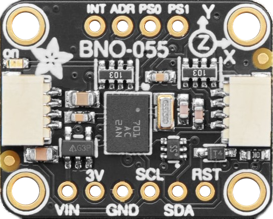

IMU
===

The BFMC car uses a 9-DoF absolute orientation sensor based on the **Bosch BNO055**.  
Across the years, three revisions of the IMU board were produced, all electrically compatible and using the same sensor.

.. |imu23| image:: ../../images/hardwaresetupforcar/products/imu_2023.png
   :width: 30%

.. |imu24| image:: ../../images/hardwaresetupforcar/products/imu_2024.png
   :width: 30%

Available IMU board versions
----------------------------

|imu23| |imu24| |imu25|

All boards contain the **BNO055** module (3-axis accelerometer, 3-axis gyroscope, 3-axis magnetometer, with on-chip sensor fusion).

The pinout is identical between versions:

- +5V/VIN: IMU supply input  
- GND: Ground 
- RST: IMU reset pin (active low)  
- INT: Interrupt output (optional)  
- ADR: I2C address selection  
- SCL: I2C clock  
- SDA: I2C data  

IMU specifications
------------------

- Sensor: **Bosch BNO055**
- Fusion algorithm: On-chip 9-DoF fusion (NDOF mode)
- Communication interface: **I2C**
- Default I2C address:  
    - 0x28 when ADR = GND  
    - 0x29 when ADR = 3V3
- Supply voltage: **5V input**, regulated on-board to 3.3V
- I/O voltage levels (I2C, INT, RST): **3.3V**
- Typical current consumption: ~12–15 mA
- Output data rate: configurable (typically 100 Hz recommended for BFMC) 

Operating notes
---------------

- The IMU should be mounted rigidly and as close as possible to the vehicle's center of rotation.
- For best performance, the **NDOF** fusion mode is recommended.
- Before starting the run, allow a few seconds for the internal fusion to stabilise.
- The INT pin can be used for:
    - data ready interrupt  
    - fusion event interrupt (optional)
- The RST pin can be used to manually reset the sensor if needed.

How to connect your IMU (per board)
--------------------------------------------

All boards use the same BNO055 sensor and are electrically
compatible, but the connector pin labels differ slightly between versions.

Please identify your board below and follow the corresponding wiring diagram.

Board A
--------

.. image:: ../../images/hardwaresetupforcar/products/imu_2023.png
   :align: center
   :width: 50%

.. raw:: html

   

Pin mapping (from left to right):

- +5V: IMU supply input  
- GND: Ground  
- SCL: I2C clock  
- SDA: I2C data  
- **INT:** I2C address selection (ADR)  
- **ADR:** Interrupt output (INT)  
- RST: IMU reset (active low)

.. warning:: 
   This revision uses a different silkscreen convention for the INT and ADR pins.
   Functionally the signals are identical to newer versions; only the printed labels
   differ.

Board B
--------

.. image:: ../../images/hardwaresetupforcar/products/imu_2024.png
   :align: center
   :width: 50%

.. raw:: html

   

Pin mapping (from left to right):

- +5V: IMU supply input  
- GND: Ground  
- BOOT: Boot mode pin (unused in normal operation)  
- DNC: Do not connect  
- RST: IMU reset (active low)  
- INT: Interrupt output (optional)  
- ADR: I2C address selection  
- SCL: I2C clock  
- SDA: I2C data  

Board C
--------

.. raw:: html

   

Pin mapping (from left to right):

- +5V: IMU supply input  
- GND: Ground  
- BOOT: Boot mode pin (unused in normal operation)  
- DNC: Do not connect  
- RST: IMU reset (active low)  
- INT: Interrupt output (optional)  
- ADR: I2C address selection  
- SCL: I2C clock  
- SDA: I2C data  

.. tip:: 
   Address select also available via shorting the solder jumper on the back of the board: