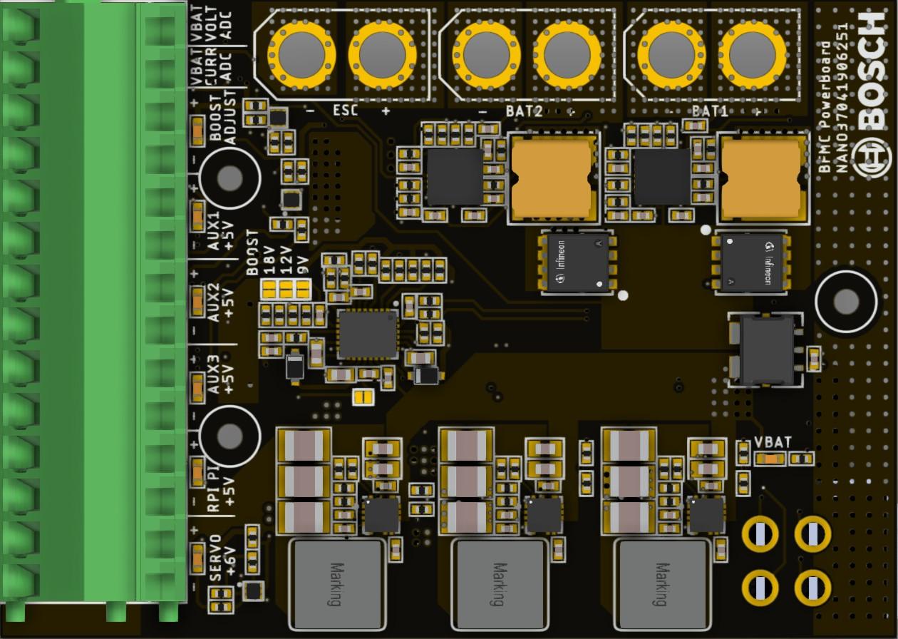

Power board
------------

On the robot we built a power distribution board which has the role of managing all the aspects of the power 
management inside the car.

.. raw:: html

   

For the protection of the batteries, the Powerboard has the following features:
    - To increase the cars autonomy, two batteries can be connected at any time (the board will work just fine with one).
    - The **VBAT CURR ADC** pin returns a voltage value proportional to the instant consumption of the board **(~0.33V = 0A, ~2.97V = 100A)**. *(Sensitivity ≈ 26.4 mV/A ; Formula: I(A) ≈ (Vadc - 0.33 V) / 0.0264)*
    - The **VBAT VOLT ADC** pin returns a voltage value proportional to the total voltage of the battery/s level **(~1.615V = 7V, ~2.908V = 16V)**.
    - The **BOOST ADJUST** output can be configured to **9V / 12.1V / 18V**, with a maximum output current of **6A**.
    - The **(AUX 1/2/3)** pins are **5V** outputs, each with a maximum current of **1A** (per output).
    - The **RPI** supply pin provides **5V**, with a maximum recommended current of **4A**.
    - The **SERVO** connector must be used to supply the servo motor **(6V, max 5A)**
    - For the current to flow through the board, the switch has to be enabled (Short). The **VBAT LED** indicates that the Powerboard is powered.
    - If the current goes below 7V, the board will shut itself down. In this case, the **VBAT LED** will be off. To safely replace the battery, switch off the board, change it with a fully charged one( >=7.35V), then switch it on.  
    - If **VBAT LED** is off, the board is not active and the current consumption is almost zero.
    - Each main power output **(SERVO, RPI, AUX1, AUX2, AUX3, BOOST)** has its own status LED. These LEDs are normally ON whenever the Powerboard is powered.
    - If one of these LEDs is **OFF** while the board is **ON**, it indicates a short-circuit condition or an overcurrent fault on that specific connector.
    - If the LED is on and no additional devices(DC motor, servo motor, development board etc) are functional the current consumption is around 70mA.

All the data related to the powerboard can be found here:
`Power Distribution Board <https://github.com/ECC-BFMC/Documentation/tree/master/source/PCB/PWR_BOARD_NANO>`_